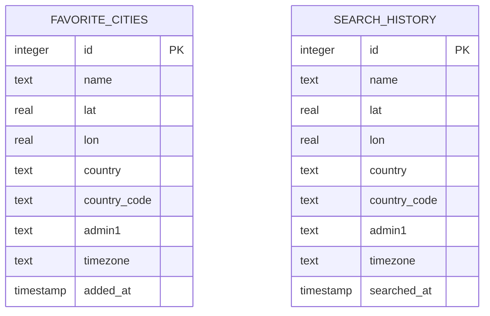

# Database Documentation

This document describes the database design, entity schemas, relationships, and ORM mapping for the **Aerisyn AI Weather Intelligence Platform**.

---

## Entity Relationship Diagram

The database utilizes PostgreSQL and contains two central tables that manage user location interactions: `favorite_cities` and `search_history`.



---

## Data Dictionary

### 1. `favorite_cities` Table
Saves geographic coordinates for locations bookmarked by users.

| Column | Data Type | Constraints | Description |
| :--- | :--- | :--- | :--- |
| `id` | `serial` | Primary Key, Not Null | Unique identifier |
| `name` | `text` | Not Null | Name of the city |
| `lat` | `real` | Not Null | Latitude coordinate |
| `lon` | `real` | Not Null | Longitude coordinate |
| `country` | `text` | Not Null | Country name |
| `country_code`| `text` | Nullable | 2-letter ISO country code |
| `admin1` | `text` | Nullable | Region or state name |
| `timezone` | `text` | Nullable | Timezone string (e.g. `Asia/Kolkata`) |
| `added_at` | `timestamp` | Default: `now()`, Not Null| Timestamp when saved |

### 2. `search_history` Table
Tracks coordinates searched by the user (capped at the 20 most recent entries in queries).

| Column | Data Type | Constraints | Description |
| :--- | :--- | :--- | :--- |
| `id` | `serial` | Primary Key, Not Null | Unique identifier |
| `name` | `text` | Not Null | Name of the city |
| `lat` | `real` | Not Null | Latitude coordinate |
| `lon` | `real` | Not Null | Longitude coordinate |
| `country` | `text` | Not Null | Country name |
| `country_code`| `text` | Nullable | 2-letter ISO country code |
| `admin1` | `text` | Nullable | Region or state name |
| `timezone` | `text` | Nullable | Timezone string |
| `searched_at` | `timestamp`| Default: `now()`, Not Null| Timestamp when searched |

---

## Drizzle ORM Schema Mapping

Tables are defined in TypeScript under `packages/db/src/schema/`.

- **Favorites Definition**: [favorites.ts](file:///c:/Users/karth/Downloads/Code-Review-Bot%20%281%29/Code-Review-Bot/packages/db/src/schema/favorites.ts)
- **Search History Definition**: [search-history.ts](file:///c:/Users/karth/Downloads/Code-Review-Bot%20%281%29/Code-Review-Bot/packages/db/src/schema/search-history.ts)

```typescript
export const favoriteCitiesTable = pgTable("favorite_cities", {
  id: serial("id").primaryKey(),
  name: text("name").notNull(),
  lat: real("lat").notNull(),
  lon: real("lon").notNull(),
  country: text("country").notNull(),
  countryCode: text("country_code"),
  admin1: text("admin1"),
  timezone: text("timezone"),
  addedAt: timestamp("added_at").defaultNow().notNull(),
});
```
